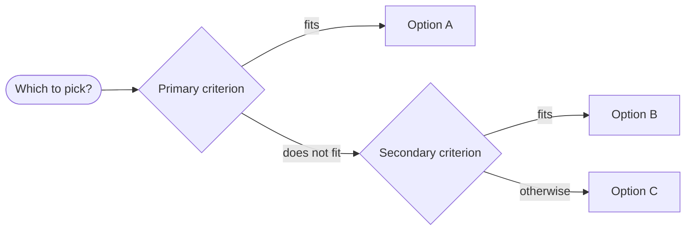
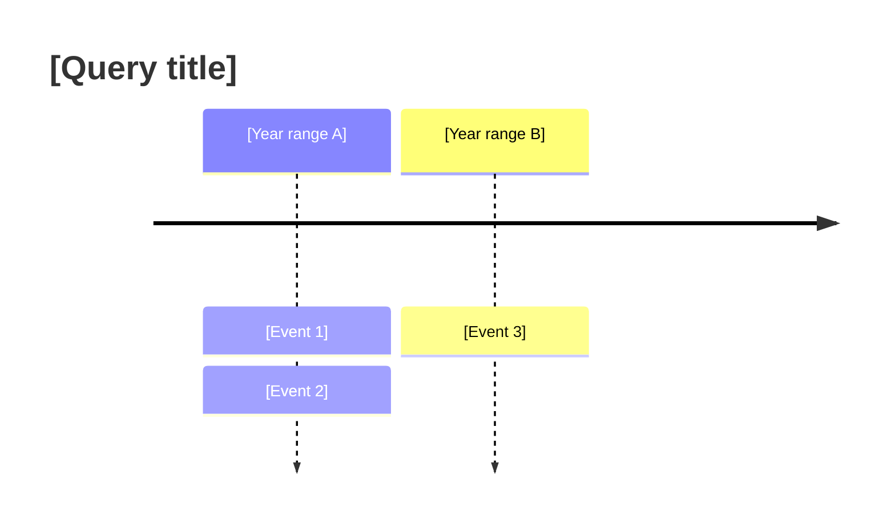

# Deep Research

Produces **saved files**, not chat text. Every run creates a timestamped directory with a browsable dashboard, structured report, and raw evidence.

---

## Setup (before anything else)

1. Determine the output directory:
   - If inside a project: `[project root]/research/YYYY-MM-DD-HH-MM-[query-slug]/`
   - Otherwise: `~/research/YYYY-MM-DD-HH-MM-[query-slug]/`
   - `query-slug` = first 4-5 words of query, lowercased, hyphenated
2. Create the directory with `mkdir -p`
3. State the full output path before proceeding

Deliverables are decided in Phase 1 based on query complexity and type. The only constant: keep chat output to a short summary block. Never paste full research into chat.

---

## Phase 1: Query Analysis

Classify the query. Write this analysis in chat (briefly) before proceeding.

**Type:**
- `comparative`: X vs Y vs Z
- `exploratory`: state of X, how X works
- `temporal`: history/evolution of X
- `decision`: should we do X
- `factual`: specific facts, numbers
- `synthesis`: best approaches to X

**Answer shape:** what does a correct answer look like as a data structure? (table / timeline / ranked list / brief+evidence / narrative)

**Failure mode:** what would make this answer wrong or useless? (outdated sources / biased sources / missing key dimension)

**Artifact template:** which Phase 6 template applies?

**Deliverables:** decide here what files to produce, based on query complexity:

| Complexity | Typical deliverables |
|---|---|
| Simple factual / quick lookup | `dashboard.html` only (minimal: summary + findings sections) |
| Moderate | `evidence.md` (working file) + `dashboard.html` |
| Complex / multi-dimensional | `evidence.md` (working file) + `dashboard.html` with full charts |

`evidence.md` is an intermediate pipeline file (subagents write to it; you read it to populate the dashboard). It is not a user deliverable. `dashboard.html` is the single user-facing output for every run.

`dashboard.html` always earns its cost -- it is the only output file users read. For simple factual queries, generate a minimal dashboard (summary + findings only, skip charts and confidence table).

State the chosen deliverables here. This is the plan. Do not add files not listed.

---

## Phase 2: Research Plan (DAG)

Design as a dependency graph. Write to chat (briefly) before launching subagents.

```
INDEPENDENT (run in parallel):
  [A] Sub-question A
  [B] Sub-question B
  [C] Sub-question C

DEPENDS ON [A]:
  [D] Follow-up requiring A

DEPENDS ON [B] + [C]:
  [E] Synthesis question
```

Target **6-10 sub-questions**. Each must cover ground no other sub-question covers.

---

## Phase 2b: Plan Critique (Pre-Mortem)

Before executing, run a skeptic pass. Add any blind spots as new sub-questions.

- **Anchoring**: Am I only planning to confirm my initial framing? What's the opposite framing?
- **Missing voices**: Who disagrees with the mainstream view? Is a contrarian search planned?
- **Source homogeneity**: Will all planned queries return the same 5 SEO articles?
- **Scope drift**: Am I answering a slightly different (easier) question than asked?
- **Load-bearing assumption**: What does the entire plan rest on that hasn't been verified?

State findings. If framing is wrong, re-run Phase 1 and 2 before proceeding.

---

## Phase 3: Subagent Launch

Each independent sub-question from the DAG gets its own subagent running in parallel. Do not run searches yourself in this phase. Spawn subagents and let them do the work.

### 3a: Launch independent sub-questions

In a **single message**, launch one subagent per independent sub-question (use whatever subagent primitive your harness provides: Task tool in Cursor, `claude -p` via bash in Claude Code). Each subagent:
- Gets its own isolated context window
- Runs its own searches (minimum 5 web searches + 2 full-page fetches per subagent)
- Writes results to `evidence-[ID].md` in the shared output directory
- Returns a one-paragraph summary of what it found

**Subagent prompt template** (fill in the bracketed parts):

```
You are a research agent. Your job is to answer one specific sub-question as part of a larger research task.

ORIGINAL QUERY: [full original user query]
YOUR SUB-QUESTION: [sub-question text]
OUTPUT FILE: [full path to evidence-[ID].md]
OUTPUT DIRECTORY: [full output directory path]

Instructions:
1. Run at least 5 web searches and fetch 2 full pages to research your sub-question thoroughly.
   Vary your query angles:
   - Broad: "[topic] 2026"
   - Specific: "[topic] [metric] site:[authority-domain]"
   - Contrarian: "[topic] problems failure criticism"
   - Comparative: "[topic] vs [alternative]"
2. Extract atomic claims (not summaries). Each claim is one sentence.
3. Write ALL findings to [full path to evidence-[ID].md] using this format:

## [Sub-question text]

CLAIM: [one-sentence fact]
SOURCE: [URL]
FRESHNESS: [date or "unknown"]
CONFIDENCE: high | medium | low | conflicted
NOTE: [only if conflicted]

CLAIM: ...

4. After writing the file, return a short paragraph summarizing:
   - The 2-3 most important findings
   - The overall confidence level
   - Any significant gaps or conflicts you found
```

### 3b: Launch dependent sub-questions

After independent subagents complete, read their `evidence-[ID].md` files, then launch subagents for dependent sub-questions, passing relevant findings from dependencies as context in the prompt.

Use the same subagent prompt template, adding:
```
CONTEXT FROM PRIOR RESEARCH:
[paste relevant claims from dependency evidence files]
```

### 3c: Merge evidence

After all subagents complete, merge all `evidence-[ID].md` files into `evidence.md`:

```bash
cat [output-dir]/evidence-*.md > [output-dir]/evidence.md
```

**Minimum search budget across all subagents combined: 25 web searches + 10 full-page fetches.** If the total falls short (check by counting searches in evidence files), run additional searches yourself to fill the gap before moving to Phase 4.

---

## Phase 4: Evidence Store

Append to `evidence.md` after each search batch:

```
## [Sub-question ID]: [Sub-question text]

CLAIM: [one-sentence atomic fact]
SOURCE: [full URL; never a domain name or title alone]
FRESHNESS: [date or "unknown"]
CONFIDENCE: high | medium | low | conflicted
NOTE: [only if conflicted - what each source says]

CLAIM: ...
```

**SOURCE field rules - no exceptions:**
- Always the full URL (`https://...`). Never a bare domain, publication name, or "source unavailable".
- If a claim comes from a paywalled or unresolvable page, record the URL anyway and mark FRESHNESS "paywalled".
- One SOURCE per CLAIM. If two sources back the same claim, record the claim twice with different SOURCE lines.

**Confidence rules:**
- `high`: 2+ independent primary sources agree
- `medium`: 1 credible primary source, or multiple secondary sources
- `low`: single secondary source, or inference
- `conflicted`: sources disagree; document both positions

---

## Phase 5: Gap Analysis

After merging all evidence, run gap check against `evidence.md`:

- Sub-questions with only `low`/`conflicted` evidence: spawn a targeted subagent with a tighter, more specific prompt
- New sub-questions that emerged during research: add to plan and spawn a subagent
- Load-bearing claims with weak sourcing: spawn a subagent specifically tasked with finding a primary source or disconfirming evidence
- Same sources appearing repeatedly: stop, that search space is saturated

For each gap requiring more research, spawn one subagent per gap (in parallel if multiple gaps). Merge results back into `evidence.md`. One gap-fill round maximum.

---

## Phase 6: Synthesis

Synthesize your findings into a structured artifact. **Do not write to a file yet** -- the synthesis will be written directly into `dashboard.html` `#findings` in Phase 8. Hold it in context.

**Do not write prose summaries. Use the template for the query type from Phase 1.**

**Citation rule for every template below:** every factual claim must carry an inline source link using the format `[[domain.com]](https://full-url)`. No claim without a source. In tables, add a source column or superscript footnotes rather than omitting citations.

### Comparative -> Table

```markdown
# [Query Title]
*Research date: [date] | Sources: N | Confidence: overall rating*

| Dimension | Option A | Option B | Option C |
|-----------|----------|----------|----------|
| [dim]     | [value] [[src]](url) | [value] [[src]](url) | [value] [[src]](url) |

*† = low-confidence source*

## Conflicts & gaps
[What sources disagreed on, what couldn't be found (each conflict cites both URLs)]
```

#### Visual supplements (comparative)

In `dashboard.html` `#charts` section, after the main comparison table:

1. **Horizontal comparison bars** -- for each key rated dimension, normalise each option's value 0-100 and emit:
```html
<div class="hbar-group">
  <div class="hbar-label">[Dimension name]</div>
  <div class="hbar-row">
    <span class="hbar-name">[Option A]</span>
    <div class="hbar-track"><div class="hbar" data-val="[0-100]" style="background:var(--high)"></div></div>
    <span class="hbar-val">[display value]</span>
  </div>
  <!-- repeat per option -->
</div>
```

2. **Heat-map matrix** (when 3+ options and 4+ dimensions) -- rows = dimensions, cols = options:
```html
<div class="heatmap" style="grid-template-columns: 140px repeat([N_options], 1fr)">
  <div class="hm-head"></div>
  <div class="hm-head">[Option A]</div><!-- repeat -->
  <div class="hm-cell-label">[Dimension 1]</div>
  <div class="hm-cell tag-high">[value]</div><!-- repeat, use tag-high/med/low/conf class for confidence color -->
</div>
```

In `dashboard.html` `#findings`, after the main table, embed a mermaid decision flowchart as a `<pre class="mermaid">` block (renders in browsers with the mermaid CDN, or as a readable code block otherwise):


### Temporal -> Timeline

```markdown
# [Query Title]

| Year | Event | Source | Confidence |
|------|-------|--------|------------|
| 2020 | [event] | [[domain.com]](https://url) | high |

## Key turning points
[2-3 sentences on inflection points, each ending with [[domain.com]](url)]
```

#### Visual supplements (temporal)

In `dashboard.html` `#charts` section, emit an inline SVG timeline. Place events on a 0-100% x-axis proportional to the year range. Alternate labels above/below the axis to avoid overlap. Encode confidence as circle radius (high=8, medium=6, low=4) and stroke style (conflicted = `stroke-dasharray="4 2"`). Each circle wraps an `<a>` linking to its source URL.

```html
<div class="timeline-wrap">
<svg class="timeline-svg" viewBox="0 0 900 160" xmlns="http://www.w3.org/2000/svg">
  <!-- axis line -->
  <line x1="40" y1="80" x2="860" y2="80" stroke="var(--border)" stroke-width="2"/>
  <!-- per event: x = 40 + (year - minYear)/(maxYear - minYear) * 820 -->
  <a href="[source URL]" target="_blank" rel="noopener">
    <circle cx="[x]" cy="80" r="[6-8]" fill="var(--accent)" stroke="var(--accent)" stroke-width="2"/>
  </a>
  <!-- label above (even events) -->
  <text x="[x]" y="[60]" text-anchor="middle" font-size="11" fill="var(--text)">[Year]: [event short label]</text>
  <!-- label below (odd events) -->
  <text x="[x]" y="[108]" text-anchor="middle" font-size="11" fill="var(--text)">[Year]: [event short label]</text>
  <!-- year tick labels on axis -->
  <text x="[x]" y="95" text-anchor="middle" font-size="10" fill="var(--muted)">[Year]</text>
</svg>
</div>
```

In `dashboard.html` `#findings`, after the events table, embed a mermaid timeline as a `<pre class="mermaid">` block:


### Decision -> Brief + Evidence

```markdown
# [Query Title]

## Recommendation
[One direct sentence: yes / no / depends on X] [[primary-source.com]](url)

## Why
- [Reason 1] [[source.com]](url)
- [Reason 2] [[source.com]](url)
- [Reason 3] [[source.com]](url)

## Risks / unknowns
- [What could invalidate this] [[source.com]](url) *(confidence: low)*

## Full evidence
[Organized by sub-question; every claim has [[domain]](url)]
```

#### Visual supplements (decision)

In `dashboard.html` `#charts` section, emit a vertical bar chart ranking all evaluated options by evidence weight. Score each option 0-10 based on the balance of supporting vs. qualifying evidence. Bar height = `score/10 * 100%`. Color: score >= 7 = `var(--high)`, 4-6 = `var(--med)`, < 4 = `var(--low)`.

```html
<div class="bar-chart-wrap">
  <div class="bar-chart">
    <div class="bar-col">
      <div class="bar" data-val="[0-100]" style="background:var(--high)"></div>
      <div class="bar-label">[Option A]</div>
      <div class="bar-score">[score]/10</div>
    </div>
    <!-- repeat per option, tallest bar = highest-scoring option = recommended -->
  </div>
  <div class="bar-chart-caption">Evidence-weighted score (0-10)</div>
</div>
```

No extra diagram needed for the decision type -- the recommendation brief in `#findings` is already the primary artifact.

### Exploratory / Synthesis -> Claim Map

```markdown
# [Query Title]

## High-confidence findings
- [Claim] [[source.com]](url)

## Contested / unclear
- [Claim]: [[Source A]](urlA) says X / [[Source B]](urlB) says Y

## Couldn't find
- [What was searched for but not found]

## Summary
[Narrative only where structure doesn't fit; keep under 200 words, inline citations throughout]
```

#### Visual supplements (exploratory / synthesis)

In `dashboard.html` `#charts` section, emit a concept cluster SVG -- a simple force-free layout with the central topic in the middle and key claim nodes radiating outward. Connect nodes with lines. Color node borders by confidence tier.

```html
<svg class="concept-svg" viewBox="0 0 700 400" xmlns="http://www.w3.org/2000/svg">
  <!-- center node -->
  <circle cx="350" cy="200" r="40" fill="var(--accent)" opacity="0.15" stroke="var(--accent)" stroke-width="2"/>
  <text x="350" y="204" text-anchor="middle" font-size="13" font-weight="600" fill="var(--accent)">[Topic]</text>
  <!-- spoke lines -->
  <line x1="350" y1="200" x2="[x]" y2="[y]" stroke="var(--border)" stroke-width="1.5"/>
  <!-- satellite node (one per major claim/theme, placed at even angles around center) -->
  <circle cx="[x]" cy="[y]" r="28" fill="var(--surface)" stroke="var(--high)" stroke-width="2"/>
  <text x="[x]" y="[y+4]" text-anchor="middle" font-size="11" fill="var(--text)">[Claim label]</text>
  <!-- repeat for each key theme (aim for 5-8 nodes) -->
</svg>
```

In `dashboard.html` `#findings`, after the claim map, embed a mermaid mindmap as a `<pre class="mermaid">` block:
```mermaid
mindmap
  root([Topic])
    Theme A
      Claim 1
      Claim 2
    Theme B
      Claim 3
    Theme C
      Claim 4
      Claim 5
```

#### Visual supplements (all query types)

Always include the confidence donut in `#summary` of the dashboard. Count high/medium/low/conflicted claims from `evidence.md` and set the `data-` attributes:

```html
<div id="confidence-donut"
  data-high="[count]"
  data-med="[count]"
  data-low="[count]"
  data-conf="[count]"
  class="donut"
  title="Evidence confidence distribution">
</div>
<div class="donut-legend">
  <span class="tag tag-high">high: [N]</span>
  <span class="tag tag-med">medium: [N]</span>
  <span class="tag tag-low">low: [N]</span>
  <span class="tag tag-conf">conflicted: [N]</span>
</div>
```

The JS in Phase 8 will convert these counts into a `conic-gradient` automatically.

### Always append

```markdown
---
**Sources consulted:** N  
**Primary sources:** X  
**Most recent data:** [date]  
**Gaps:** [What this didn't cover and why]  
**Follow-up questions:** 
- [Question 1]
- [Question 2]
- [Question 3]
```

---

## Phase 7: Output Evaluation + Patch Loop

Score your Phase 6 synthesis (held in context) against the original query:

```
COMPLETENESS   [0-3]  covers all meaningful dimensions?
ACCURACY       [0-3]  load-bearing claims have high-confidence sources?
RELEVANCE      [0-3]  answers the actual question, not an easier adjacent one?
ARTIFACT FIT   [0-3]  right format for the query type?
TOTAL: /12
```

- **10-12**: proceed to Phase 8 (dashboard)
- **7-9**: patch: spawn one subagent targeting the lowest-scoring dimension, update the relevant section of your synthesis in context, re-score once
- **0-6**: restart Phase 1 (framing was wrong, patching won't fix it)

Max 2 patch rounds. After 2, deliver with explicit notes on what remains weak.

Patch subagent prompt adds:
```
PATCH CONTEXT: This is a targeted patch for a deep research run.
WEAK DIMENSION: [completeness / accuracy / relevance / artifact fit]
GAP: [specific description of what's missing]
EXISTING FINDINGS: [paste relevant section of evidence.md]
YOUR TASK: Find sources that specifically address this gap. Return findings in evidence format.
```

---

## Phase 8: Dashboard

**Do not generate the HTML structure from scratch.** Read the template file first, then write one complete filled-in `dashboard.html`.

### Steps

1. **Read the template:**
```bash
cat [skill-directory]/dashboard-template.html
```
The skill directory is the directory containing this SKILL.md file (e.g. `/Users/you/.cursor/skills/deep-research/`).

2. **Write the complete dashboard** to `[output-dir]/dashboard.html` using the template as your structural base. Populate every placeholder in a single `Write` call -- do not use StrReplace on placeholders. You have full freedom to adapt the structure for your query type.

**What to populate in each section:**

| Section | Content source |
|---|---|
| `<title>` and `<h1>` | Query title |
| `.nav-meta`, `.meta` | Date, source count, score |
| `#summary` score cards + donut | Phase 7 scores; count `CONFIDENCE: high/medium/low/conflicted` lines in `evidence.md` |
| `#charts` | Phase 6 visual supplements for your query type (see instructions above) |
| `#findings` | Your Phase 6 synthesis -- the full structured artifact (table / timeline / brief / claim map) |
| `#confidence` tbody | One `<tr>` per key claim from `evidence.md` (curate to most important ~20-40 for long runs) |
| `#sources` | One `<li>` per unique URL from `evidence.md`, ordered by confidence then freshness |
| `#gaps` | Gaps and follow-up questions from your synthesis |

**Source link rule:** every URL from `evidence.md` must appear as a real `<a href="..." target="_blank" rel="noopener">` link. Never render a URL as plain text.

3. **Open the dashboard:**
```bash
open [output-dir]/dashboard.html   # macOS
```

<!-- TEMPLATE REFERENCE (do not copy this block -- read dashboard-template.html instead)
<!DOCTYPE html>
<html lang="en">
<head>
  <meta charset="UTF-8">
  <meta name="viewport" content="width=device-width, initial-scale=1">
  <title>[Query] -- Deep Research</title>
  <style>
    *, *::before, *::after { box-sizing: border-box; }
    :root {
      --nav-w: 230px;
      --nav-bg: #0f172a;
      --nav-text: #94a3b8;
      --nav-active: #f8fafc;
      --accent: #6366f1;
      --bg: #f8fafc;
      --surface: #ffffff;
      --border: #e2e8f0;
      --text: #1e293b;
      --muted: #64748b;
      --high: #16a34a; --high-bg: #dcfce7;
      --med:  #b45309; --med-bg:  #fef3c7;
      --low:  #dc2626; --low-bg:  #fee2e2;
      --conf: #7c3aed; --conf-bg: #ede9fe;
    }
    body { font-family: system-ui, -apple-system, sans-serif; margin: 0; background: var(--bg); color: var(--text); line-height: 1.6; }

    /* Sidebar nav (desktop) */
    nav {
      position: fixed; top: 0; left: 0; width: var(--nav-w);
      height: 100vh; overflow-y: auto;
      background: var(--nav-bg); padding: 28px 20px;
      display: flex; flex-direction: column; gap: 4px;
      z-index: 100;
    }
    .nav-brand { color: #f8fafc; font-weight: 700; font-size: 15px; margin-bottom: 20px; letter-spacing: -0.3px; }
    .nav-brand span { color: var(--accent); }
    nav a { color: var(--nav-text); text-decoration: none; padding: 7px 10px; border-radius: 6px; font-size: 13.5px; transition: background 0.15s, color 0.15s; }
    nav a:hover, nav a.active { background: rgba(255,255,255,0.08); color: var(--nav-active); }
    nav a.active { border-left: 3px solid var(--accent); padding-left: 7px; }
    .nav-meta { margin-top: auto; font-size: 11px; color: #475569; line-height: 1.8; border-top: 1px solid #1e293b; padding-top: 16px; }

    /* Mobile top bar */
    .mobile-bar {
      display: none; position: sticky; top: 0; z-index: 200;
      background: var(--nav-bg); padding: 0 16px;
      overflow-x: auto; white-space: nowrap;
      box-shadow: 0 1px 4px rgba(0,0,0,0.3);
    }
    .mobile-bar a { display: inline-block; color: var(--nav-text); text-decoration: none; padding: 14px 12px; font-size: 13px; }
    .mobile-bar a:hover { color: var(--nav-active); }

    /* Main content */
    main { margin-left: var(--nav-w); padding: 48px 52px; max-width: calc(var(--nav-w) + 860px); }
    h1 { font-size: 26px; font-weight: 700; letter-spacing: -0.5px; margin: 0 0 6px; }
    h2 { font-size: 18px; font-weight: 600; margin: 40px 0 14px; border-bottom: 1px solid var(--border); padding-bottom: 8px; }
    h3 { font-size: 15px; font-weight: 600; margin: 24px 0 8px; color: var(--muted); }
    .meta { color: var(--muted); font-size: 14px; margin-bottom: 32px; }

    /* Score cards */
    .score-grid { display: grid; grid-template-columns: repeat(4, 1fr); gap: 12px; margin: 20px 0 32px; }
    .score-card { background: var(--surface); border: 1px solid var(--border); border-radius: 10px; padding: 18px 14px; text-align: center; box-shadow: 0 1px 3px rgba(0,0,0,0.05); }
    .score-card .num { font-size: 30px; font-weight: 700; color: var(--accent); }
    .score-card .label { font-size: 12px; color: var(--muted); margin-top: 2px; }
    .total-score { background: var(--accent); color: white; border-radius: 10px; padding: 14px 20px; font-weight: 600; font-size: 15px; text-align: center; margin-bottom: 24px; }

    /* Takeaways */
    .takeaways { list-style: none; padding: 0; margin: 0 0 16px; }
    .takeaways li { display: flex; gap: 10px; padding: 10px 14px; background: var(--surface); border: 1px solid var(--border); border-radius: 8px; margin-bottom: 8px; font-size: 14.5px; }
    .takeaways li::before { content: "->"; color: var(--accent); flex-shrink: 0; }

    /* Tables */
    .table-wrap { overflow-x: auto; -webkit-overflow-scrolling: touch; border-radius: 8px; border: 1px solid var(--border); margin: 16px 0; }
    table { width: 100%; border-collapse: collapse; font-size: 14px; }
    thead th { background: #f1f5f9; padding: 11px 14px; text-align: left; font-size: 12.5px; font-weight: 600; color: var(--muted); text-transform: uppercase; letter-spacing: 0.4px; white-space: nowrap; }
    tbody tr:hover { background: #f8fafc; }
    td { padding: 11px 14px; border-top: 1px solid var(--border); vertical-align: top; }

    /* Confidence tags */
    .tag { display: inline-block; padding: 2px 9px; border-radius: 100px; font-size: 11.5px; font-weight: 600; }
    .tag-high { background: var(--high-bg); color: var(--high); }
    .tag-med  { background: var(--med-bg);  color: var(--med); }
    .tag-low  { background: var(--low-bg);  color: var(--low); }
    .tag-conf { background: var(--conf-bg); color: var(--conf); }

    /* Source links */
    .sources-list { list-style: none; padding: 0; margin: 0; }
    .sources-list li { display: grid; grid-template-columns: 24px 1fr auto; gap: 10px; align-items: start; padding: 10px 14px; background: var(--surface); border: 1px solid var(--border); border-radius: 8px; margin-bottom: 6px; font-size: 13.5px; }
    .src-num { color: var(--muted); font-size: 12px; padding-top: 2px; }
    .src-link { color: var(--accent); text-decoration: none; word-break: break-all; }
    .src-link:hover { text-decoration: underline; }
    .src-meta { font-size: 12px; color: var(--muted); white-space: nowrap; }

    /* Gap / follow-up cards */
    .gap-list { list-style: none; padding: 0; margin: 0; }
    .gap-list li { padding: 10px 14px 10px 38px; background: var(--surface); border: 1px solid var(--border); border-radius: 8px; margin-bottom: 6px; font-size: 14px; position: relative; }
    .gap-list li::before { content: "?"; position: absolute; left: 14px; color: var(--muted); font-weight: 700; }
    .followup-list { list-style: none; padding: 0; margin: 0; }
    .followup-list li { padding: 10px 14px 10px 38px; background: #eff6ff; border: 1px solid #bfdbfe; border-radius: 8px; margin-bottom: 6px; font-size: 14px; position: relative; }
    .followup-list li::before { content: "->"; position: absolute; left: 14px; color: #3b82f6; font-weight: 700; }

    /* Confidence donut */
    .summary-top { display: flex; gap: 24px; align-items: flex-start; flex-wrap: wrap; margin-bottom: 8px; }
    .donut-wrap { display: flex; flex-direction: column; align-items: center; gap: 10px; flex-shrink: 0; }
    .donut { width: 110px; height: 110px; border-radius: 50%; background: var(--border); position: relative; }
    .donut::after { content: ''; position: absolute; inset: 22px; border-radius: 50%; background: var(--bg); }
    .donut-legend { display: flex; flex-direction: column; gap: 4px; }
    .donut-legend span { font-size: 12px; }

    /* Horizontal bar chart (comparison bars) */
    .hbar-group { margin-bottom: 18px; }
    .hbar-label { font-size: 12px; font-weight: 600; color: var(--muted); text-transform: uppercase; letter-spacing: 0.4px; margin-bottom: 6px; }
    .hbar-row { display: flex; align-items: center; gap: 10px; margin-bottom: 5px; }
    .hbar-name { font-size: 13px; min-width: 120px; flex-shrink: 0; color: var(--text); }
    .hbar-track { flex: 1; height: 10px; background: var(--border); border-radius: 5px; overflow: hidden; }
    .hbar { height: 100%; border-radius: 5px; width: 0; transition: width 0.6s ease; }
    .hbar-val { font-size: 12px; color: var(--muted); min-width: 40px; text-align: right; }

    /* Vertical bar chart (decision ranking) */
    .bar-chart-wrap { margin: 16px 0; }
    .bar-chart { display: flex; align-items: flex-end; gap: 12px; height: 180px; padding: 0 4px; border-bottom: 2px solid var(--border); }
    .bar-col { display: flex; flex-direction: column; align-items: center; flex: 1; height: 100%; justify-content: flex-end; }
    .bar { width: 100%; border-radius: 4px 4px 0 0; height: 0; transition: height 0.6s ease; min-height: 4px; }
    .bar-label { font-size: 12px; text-align: center; margin-top: 8px; color: var(--text); font-weight: 500; word-break: break-word; }
    .bar-score { font-size: 11px; color: var(--muted); margin-top: 2px; }
    .bar-chart-caption { font-size: 12px; color: var(--muted); text-align: center; margin-top: 6px; }

    /* Heat-map matrix */
    .heatmap { display: grid; gap: 3px; margin: 12px 0; }
    .hm-head { font-size: 12px; font-weight: 600; color: var(--muted); padding: 6px 10px; text-align: center; }
    .hm-cell-label { font-size: 12px; font-weight: 500; color: var(--text); padding: 8px 10px; display: flex; align-items: center; }
    .hm-cell { border-radius: 4px; padding: 7px 10px; font-size: 12px; text-align: center; }
    .hm-cell.tag-high { background: var(--high-bg); color: var(--high); }
    .hm-cell.tag-med  { background: var(--med-bg);  color: var(--med); }
    .hm-cell.tag-low  { background: var(--low-bg);  color: var(--low); }
    .hm-cell.tag-conf { background: var(--conf-bg); color: var(--conf); }

    /* SVG timeline */
    .timeline-wrap { overflow-x: auto; -webkit-overflow-scrolling: touch; margin: 12px 0; padding: 8px 0; }
    .timeline-svg { width: 100%; min-width: 600px; display: block; }

    /* Concept cluster SVG */
    .concept-wrap { overflow-x: auto; margin: 12px 0; }
    .concept-svg { width: 100%; display: block; max-width: 700px; margin: 0 auto; }

    /* Responsive */
    @media (max-width: 768px) {
      nav { display: none; }
      .mobile-bar { display: block; }
      main { margin-left: 0; padding: 24px 18px; }
      .score-grid { grid-template-columns: repeat(2, 1fr); }
      h1 { font-size: 20px; }
      .sources-list li { grid-template-columns: 20px 1fr; }
      .src-meta { display: none; }
      .hbar-name { min-width: 80px; }
      .summary-top { flex-direction: column; }
    }
  </style>
</head>
<body>

  <!-- desktop sidebar -->
  <nav id="sidebar">
    <div class="nav-brand">Deep <span>Research</span></div>
    <a href="#summary">Summary</a>
    <a href="#charts">Charts</a>
    <a href="#findings">Findings</a>
    <a href="#confidence">Confidence</a>
    <a href="#sources">Sources</a>
    <a href="#gaps">Gaps</a>
    <div class="nav-meta">
      [Date]<br>
      [N] sources · [N] searches<br>
      Score [X]/12
    </div>
  </nav>

  <!-- mobile top strip -->
  <div class="mobile-bar">
    <a href="#summary">Summary</a>
    <a href="#charts">Charts</a>
    <a href="#findings">Findings</a>
    <a href="#confidence">Confidence</a>
    <a href="#sources">Sources</a>
    <a href="#gaps">Gaps</a>
  </div>

  <main>
    <h1>[Query]</h1>
    <p class="meta">[Date] &nbsp;·&nbsp; [N] sources &nbsp;·&nbsp; [type] query</p>

    <section id="summary">
      <h2>Summary</h2>
      <div class="total-score">Overall score: [X] / 12</div>
      <div class="summary-top">
        <div style="flex:1">
          <div class="score-grid">
            <div class="score-card"><div class="num">[N]/3</div><div class="label">Completeness</div></div>
            <div class="score-card"><div class="num">[N]/3</div><div class="label">Accuracy</div></div>
            <div class="score-card"><div class="num">[N]/3</div><div class="label">Relevance</div></div>
            <div class="score-card"><div class="num">[N]/3</div><div class="label">Artifact fit</div></div>
          </div>
        </div>
        <!-- Confidence donut: count high/medium/low/conflicted claims from evidence.md -->
        <div class="donut-wrap">
          <div id="confidence-donut"
            data-high="[count of high claims]"
            data-med="[count of medium claims]"
            data-low="[count of low claims]"
            data-conf="[count of conflicted claims]"
            class="donut"
            title="Evidence confidence distribution">
          </div>
          <div class="donut-legend">
            <span class="tag tag-high">high: [N]</span>
            <span class="tag tag-med">medium: [N]</span>
            <span class="tag tag-low">low: [N]</span>
            <span class="tag tag-conf">conflicted: [N]</span>
          </div>
        </div>
      </div>
      <h3>Key takeaways</h3>
      <ul class="takeaways">
        <li>[Takeaway 1]</li>
        <li>[Takeaway 2]</li>
        <li>[Takeaway 3]</li>
      </ul>
    </section>

    <section id="charts">
      <h2>Charts</h2>
      <!--
        QUERY-TYPE-SPECIFIC CHARTS -- choose the right block(s) based on query type from Phase 1.
        Remove unused blocks. All charts are driven by inline data; no external libraries needed.

        == ALWAYS: Confidence distribution is already in #summary above ==

        == COMPARATIVE: Horizontal comparison bars ==
        <h3>Comparison: [Dimension name]</h3>
        <div class="hbar-group">
          <div class="hbar-label">[Dimension]</div>
          <div class="hbar-row">
            <span class="hbar-name">[Option A]</span>
            <div class="hbar-track"><div class="hbar" data-val="[0-100]" style="background:var(--high)"></div></div>
            <span class="hbar-val">[display value]</span>
          </div>
          ... repeat per option ...
        </div>

        == COMPARATIVE (3+ options, 4+ dims): Heat-map matrix ==
        <h3>Evidence matrix</h3>
        <div class="heatmap" style="grid-template-columns: 140px repeat([N], 1fr)">
          <div class="hm-head"></div>
          <div class="hm-head">[Option A]</div>
          <div class="hm-cell-label">[Dimension 1]</div>
          <div class="hm-cell tag-high">[value]</div>
          ... fill in all cells; use tag-high / tag-med / tag-low / tag-conf for color ...
        </div>

        == DECISION: Vertical ranked bar chart ==
        <h3>Evidence-weighted ranking</h3>
        <div class="bar-chart-wrap">
          <div class="bar-chart">
            <div class="bar-col">
              <div class="bar" data-val="[0-100]" style="background:var(--high)"></div>
              <div class="bar-label">[Option A]</div>
              <div class="bar-score">[X]/10</div>
            </div>
            ... repeat per option, tallest = recommended ...
          </div>
          <div class="bar-chart-caption">Evidence-weighted score (0–10)</div>
        </div>

        == TEMPORAL: SVG timeline ==
        <h3>Timeline</h3>
        <div class="timeline-wrap">
        <svg class="timeline-svg" viewBox="0 0 900 160" xmlns="http://www.w3.org/2000/svg">
          <line x1="40" y1="80" x2="860" y2="80" stroke="var(--border)" stroke-width="2"/>
          ... one <a><circle></a> + <text> per event; x = 40 + ((year-minYear)/(maxYear-minYear))*820 ...
          ... alternate text y between 58 (above) and 108 (below) to avoid overlap ...
          ... circle r: high=8, medium=6, low=4; conflicted adds stroke-dasharray="4 2" ...
        </svg>
        </div>

        == EXPLORATORY / SYNTHESIS: Concept cluster SVG ==
        <h3>Concept map</h3>
        <div class="concept-wrap">
        <svg class="concept-svg" viewBox="0 0 700 400" xmlns="http://www.w3.org/2000/svg">
          <circle cx="350" cy="200" r="40" fill="var(--accent)" opacity="0.15" stroke="var(--accent)" stroke-width="2"/>
          <text x="350" y="204" text-anchor="middle" font-size="13" font-weight="600" fill="var(--accent)">[Topic]</text>
          ... 5-8 satellite nodes at evenly-spaced angles (r=140 from center) ...
          ... line from center to each satellite ...
          ... circle r=28, stroke color = confidence tier color (--high/--med/--low/--conf) ...
          ... short label text inside each circle ...
        </svg>
        </div>
      -->
    </section>

    <section id="findings">
      <h2>Findings</h2>
      <!--
        Paste the main artifact here as HTML.
        For tables: wrap in <div class="table-wrap"><table>...</table></div>
        Every claim cell that has a source: add <a href="[url]" target="_blank" rel="noopener" class="src-link">[domain]</a>
      -->
    </section>

    <section id="confidence">
      <h2>Evidence confidence</h2>
      <div class="table-wrap">
        <table>
          <thead><tr><th>Claim</th><th>Source</th><th>Freshness</th><th>Confidence</th></tr></thead>
          <tbody>
            <!--
              One row per claim from evidence.md.
              <tr>
                <td>[claim text]</td>
                <td><a href="[url]" target="_blank" rel="noopener" class="src-link">[domain.com]</a></td>
                <td>[date]</td>
                <td><span class="tag tag-high">high</span></td>
              </tr>
              Use tag-high / tag-med / tag-low / tag-conf classes.
            -->
          </tbody>
        </table>
      </div>
    </section>

    <section id="sources">
      <h2>Sources <small style="font-size:13px;font-weight:400;color:var(--muted)">([N] total)</small></h2>
      <ol class="sources-list">
        <!--
          One <li> per unique URL from evidence.md, ordered by confidence then freshness.
          <li>
            <span class="src-num">[N]</span>
            <a href="[full URL]" target="_blank" rel="noopener" class="src-link">[full URL]</a>
            <span class="src-meta"><span class="tag tag-high">high</span> &nbsp; [date]</span>
          </li>
        -->
      </ol>
    </section>

    <section id="gaps">
      <h2>Gaps &amp; follow-up</h2>
      <h3>What couldn't be found</h3>
      <ul class="gap-list">
        <li>[Gap 1]</li>
        <li>[Gap 2]</li>
      </ul>
      <h3>Follow-up questions</h3>
      <ul class="followup-list">
        <li>[Follow-up question 1]</li>
        <li>[Follow-up question 2]</li>
        <li>[Follow-up question 3]</li>
      </ul>
    </section>
  </main>

  <script>
    // --- Scroll-spy nav highlight ---
    const sections = document.querySelectorAll('section[id]');
    const navLinks = document.querySelectorAll('nav a');
    const observer = new IntersectionObserver(entries => {
      entries.forEach(e => {
        if (e.isIntersecting) {
          navLinks.forEach(a => a.classList.toggle('active', a.getAttribute('href') === '#' + e.target.id));
        }
      });
    }, { threshold: 0.3 });
    sections.forEach(s => observer.observe(s));

    // --- Confidence donut (conic-gradient from data-* counts) ---
    const donut = document.getElementById('confidence-donut');
    if (donut) {
      const h = +(donut.dataset.high) || 0;
      const m = +(donut.dataset.med)  || 0;
      const l = +(donut.dataset.low)  || 0;
      const c = +(donut.dataset.conf) || 0;
      const total = h + m + l + c || 1;
      const toDeg = n => (n / total) * 360;
      let a = 0;
      const seg = (deg, color) => {
        const s = `${color} ${a.toFixed(1)}deg ${(a + deg).toFixed(1)}deg`;
        a += deg; return s;
      };
      const gradient = [
        seg(toDeg(h), 'var(--high)'),
        seg(toDeg(m), 'var(--med)'),
        seg(toDeg(l), 'var(--low)'),
        seg(toDeg(c), 'var(--conf)'),
      ].join(', ');
      donut.style.background = `conic-gradient(${gradient})`;
    }

    // --- Animate horizontal bars (data-val = 0-100) ---
    requestAnimationFrame(() => {
      document.querySelectorAll('.hbar[data-val]').forEach(bar => {
        bar.style.width = (bar.dataset.val || 0) + '%';
      });
      // --- Animate vertical bars (data-val = 0-100 maps to height %) ---
      document.querySelectorAll('.bar[data-val]').forEach(bar => {
        bar.style.height = (bar.dataset.val || 0) + '%';
      });
    });
  </script>
</body>
</html>
```

-->

---

## Output Rules

Final chat message: short, always.

```
Research complete. Score: [X]/12 · [N] searches · [N] sources
Charts: [list chart types included, e.g. "donut, comparison bars" -- or "none" for simple queries]

📁 [output directory path]
  dashboard.html: [one-phrase description of the artifact]

Key finding: [one sentence]
Gaps: [one sentence about what's still unknown]
Follow-up: [1-2 questions worth pursuing]
```

- Never paste research content into chat
- `dashboard.html` is always produced; `evidence.md` is a working file, do not mention it in the output summary
- If the answer is genuinely unresolvable, say so directly in key finding
- **Never use em dashes (—) in any output file or chat message.** Replace with a colon, comma, semicolon, period, or parentheses as appropriate.

---

## Defaults

- **Minimum searches**: 25 web searches + 5 full-page fetches per run
- **Sub-questions**: 6-10
- **Patch rounds**: max 2
- **Stop signal**: same sources reappearing, or all evidence at `high`/`medium`
- **Search tool**: web search for discovery, full-page fetch for in-depth reading
